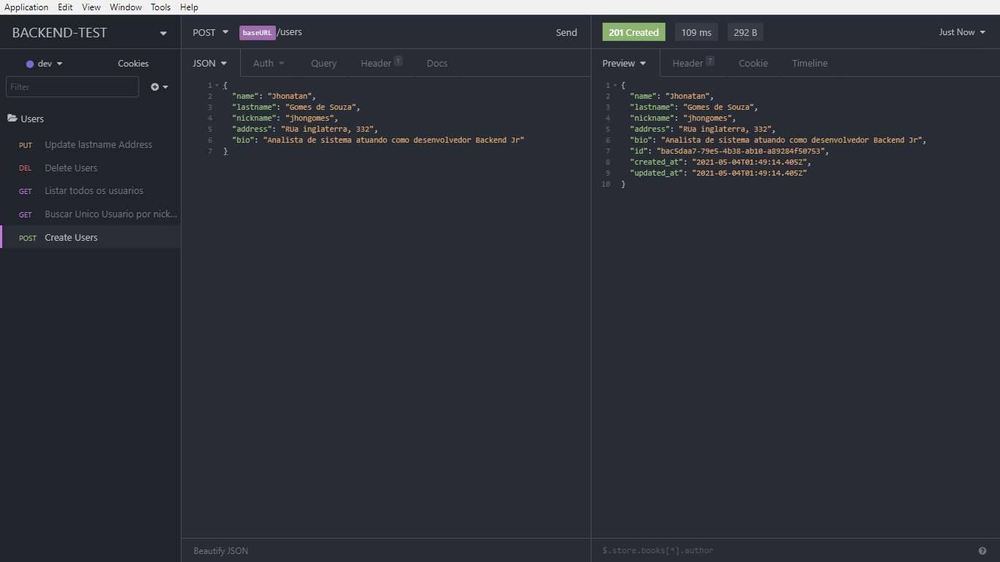
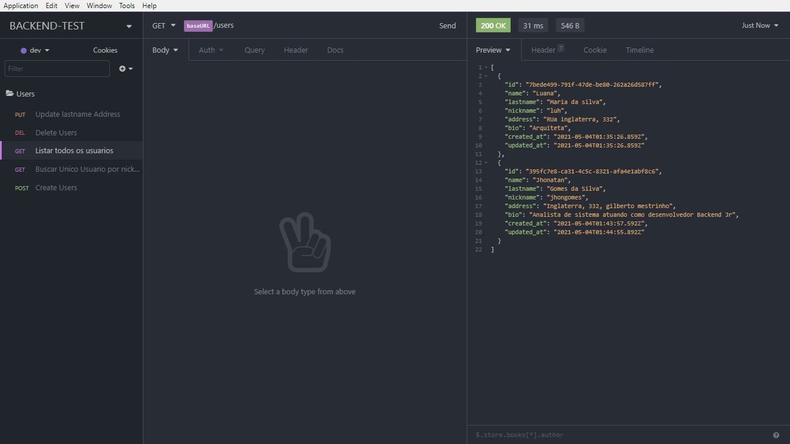
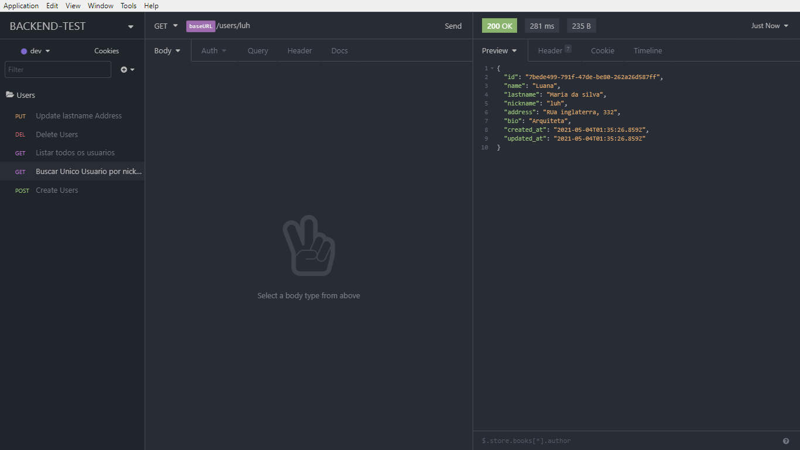
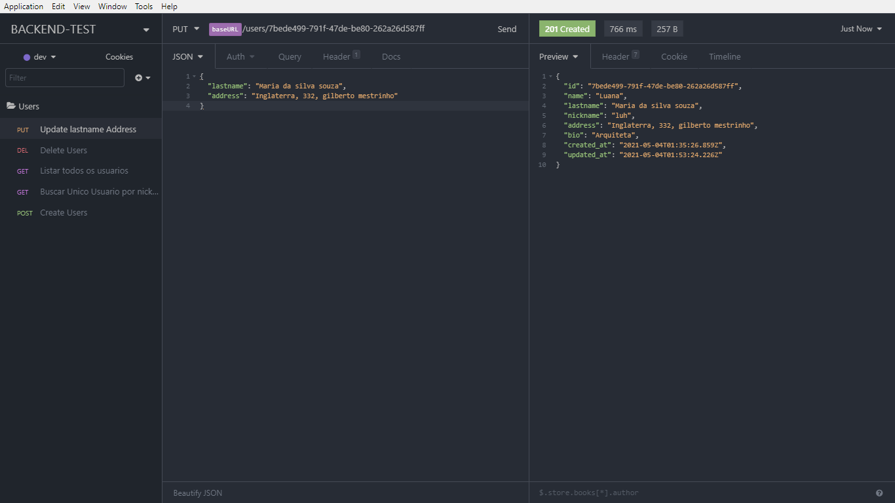
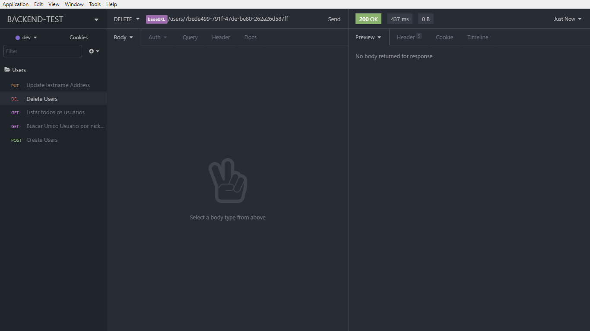

### Teste para vaga backend com Node.Js

#### Contexto

- Construir uma API REST capaz de realizar o `C.R.U.D.` seguindo os padrões atuais, manipulando os valores de entrada, processando e retornando os dados, mensagens e status coerentes.

---

#### Especificações da aplicação

- Utilize `JavaScript` ou `TypeScript`.
- Utilize as **ferramentas de sua preferência** para manipulação de requisições _http_, _banco de dados_ e outros.
- A aplicação deve ser construída utilizando o `design pattern` padrão do **MVC**.

---

##### RNF

##### **Obrigatório**

- A API deve seguir os princípios do desgin pattern `RESTful.`
- Manipulação de dados no padrão `JSON`.
- Os dados referentes à(s) entidade(s) devem ser persistidos em BD.
- Isole as operações feitas diretamente no banco de dados em repositórios.
- Retorno das requisições e status com semântica nas operações realizadas.
- Tratamento de erros e exceções.

##### **Bônus**

- Documentação da API, suas rotas e parâmetros.
- Documentação dos requisitos necessários para rodar a aplicação.

##### **Diferencial**

- Criação de suíte de testes unitários.
- Containerização da aplicação com Docker.
- Live demo da aplicação.

---

##### RF

- A entidade de Usuário deve possuir as seguintes informações:
  - id: string, (primário)(gerado automaticamente),
  - name: string,
  - lastname: string,
  - nickname: string, (único) - máx. 30 caracteres
  - address: string, // O endereço todo dentro da string
  - bio: string, (opcional) - máx. 100 caracteres // breve descrição sobre o usuário
  - createdAt: Date,
  - updatedAt: Date

- Métodos:
  - [] Cria um novo usuário recebendo os dados pelo corpo da requisição: retorna os dados do usuário criado com status correspondente.
    - Se nickname já existe, retornar status e mensagem de erro.
  - [] Listar todos os usuários cadastrados filtrados pelos campos `nome` e/ou `sobrenome`, filtrados por parâmetros de consulta: retorna um array de usuários.
  - [] Listar um usuário pelo nickname passado como parâmetro: retorna um único usuário com nome, sobrenome e nickname.
  - [] Alterar o sobrenome e o endereço do usuário recebido no corpo da requisição, baseado no id recebido como parâmetro de rota: retorna o usuário alterado com as novas informações.
  - [] Alterar o nickname de um usuário recebido no corpo da requisição, baseado no id recebido como parâmetro de rota: retorna o usuário alterado com as novas informações.
    - Se o nickname passado já existir, deve retornar status e mensagem de erro.
  - [] Deletar um usuário baseado no id recebido como parâmetro de rota: retorna o status de sucesso.


### 🚀 Tecnologias
---
Este projeto foi desenvolvido com as seguintes tecnologias:

- [Nodejs](https://nodejs.org/en/)
- [Express](http://expressjs.com/pt-br/)
- [Typescript](https://docs.microsoft.com/pt-br/archive/msdn-magazine/2015/january/typescript-understanding-typescript)
- [TypeORM](https://typeorm.io/#/)
- [Docker](https://www.docker.com/)
- [VS Code](https://code.visualstudio.com/) com [EditorConfig](https://marketplace.visualstudio.com/items?itemName=EditorConfig.EditorConfig) e [ESlint](https://marketplace.visualstudio.com/items?itemName=dbaeumer.vscode-eslint)

### ❗ Como baixar
---

Para clonar e executar esse projeto, você precisa do [Git](https://git-scm.com/), [Nodejs v12.16](https://nodejs.org/en/) ou superior + [Yarn 1.22](https://yarnpkg.com/) ou superior  instalado no seu computador. Digite na sua linha de comando:

``` bash

    # Clonar o repositório
    $ git clone https://github.com/jhongomes/node-backend-test.git

    # Entrar no repositório
    $ cd node-backend-test

    # Instalar as dependências
    $ yarn

    # Abrir projeto
    $ code .


```

### 🔗 Banco de dados

 Para estabelecer uma conexão com o banco, você precisa de [Docker v19.03](http://docs.docker.oeynet.com/toolbox/toolbox_install_windows/) ou superior instalado no seu computador. Digite na sua linha de comando:

 ``` bash
    # Criar uma imagem do postgres com docker
    $ docker run --name BACKEND -e POSTGRES_PASSWORD=docker -p  5432:5432 -d postgres

    # Executar o banco
    $ docker start BACKEND

    # Verificar a url host de conexão
    $ docker-machine ls

    # Configurar a url listada no comando acima dentro do 'ormconfig.json' do projeto
    ex url: 192.168.99.108

    # Execute o projeto
    $ yarn dev

```

### 📁 Migrations

Para migrar a tabela existente no projeto para o docker, execute o comando no terminal do seu editor:

```
$ yarn typeorm migration:run
```
---
### 🟣 Insomnia

 Para testar a API desenvolvida você precisa de [Insomnia v7.1](https://insomnia.rest/) ou superior instalado no seu computador.

``` bash
  # Gerenciar ambiente com a rota
  $ { "baseUrl": "http://localhost:3333"  }
```
---
### 💬 Recursos para cadastrar as requisições

 `post/users` : Criar um novo usuário recebendo os dados pelo corpo da requisição : `name`, `lastname`, `nickname`, `address`, `bio` .



---
  `get/users` : Listar todos os usuários cadastrados .



---
 `get/users/nickname` : Listar  um usuário pelo `nickname`  passado pelo parâmetro, retornando único usuário .



---

 `put/users/id` : Alterar `lastname` e `address` recebido pelo corpo da requisição, baseado no id recebido como parâmetro da rota .

 

---

 `delete/id` : Deletar um usuário baseado no id recebido como parâmetro da rota :

 

---
### ✔ swagger

  `http://localhost:3333/api-docs`


Feito com ❤ por Jhonatan Gomes
